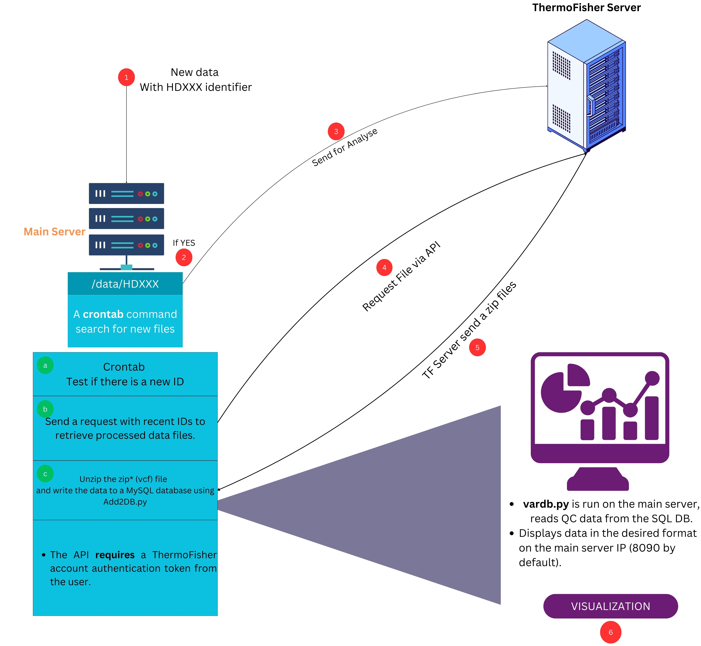

# MGDB: Genetic Variant Analysis Pipeline for Targeted Exome Sequencing

This project provides a pipeline for managing and analyzing genetic variant data from targeted exome sequencing, using standards like HD827 to track variant information across sequencing runs. The pipeline automates data download from ThermoFisher servers (or processes Illumina DRAGEN output), processes the data, and visualizes it in an interactive Dash application.

## Key Features

* Automated data download from ThermoFisher servers (or processes Illumina DRAGEN output).
* Support for ThermoFisher GENEXUS (OMA, OCA+, OFA) and Illumina DRAGEN.
* Interactive Dash application for variant tracking.
* Quality control using known standard samples (e.g., HD827).
* Dockerized deployment for easy installation and portability.

## Workflow Overview

The pipeline follows these key steps:

1. **Data Acquisition:** Raw sequencing data (VCF files) are downloaded from a ThermoFisher server via API or processed from Illumina DRAGEN output.
2. **Data Processing and Validation:** Downloaded VCF files are unzipped, validated, and the headers are standardized.
3. **Database Insertion:** Processed variant data is inserted into a MySQL database (`vardb`).
4. **Visualization:** An interactive Dash application queries the database and displays variant information for quality control and analysis.

## Architecture Diagram




## Getting Started

### Prerequisites

**Host Server:**

* Docker: Version 24.0.2 or later
* Docker Compose: Version 2.18.1 or later
* `cron` for scheduling tasks
* Git: For cloning the repository
* Python 3 and required Python packages defined in included Dockerfile.

**ThermoFisher Server (if applicable):**

* Active ThermoFisher account with API access.
* Authentication credentials for API requests.


### Installation

1. Clone the repository:

```bash
git clone https://github.com/acri-nb/GeneticVariantsDB.git
cd GeneticVariantsDB
```

2. Create a directory for persistent data storage:

```bash
mkdir -p /home/<user>/dash-files
```
Copy required configuration and demo files to the newly created directory.

```bash
cp GeneticVariantsDB/data/*.txt /home/<user>/dash-files
cp GeneticVariantsDB/data/*.tsv /home/<user>/dash-files
```
3. Build the Docker images:

```bash
docker-compose build
```

### Configuration

1. **config.txt:**  Edit `/home/<user>/dash-files/config.txt`:
    * Replace `"0.0.0.0"` with your server's IP address.
    * Enter your ThermoFisher API credentials for `usr` and `pass` (if applicable).
    * Set the `sample_prefix` to match your internal standards file names.
    * Adjust the standard deviation scalar as needed.

2. **compose.yaml:** Edit `GeneticVariantsDB/DockerMode/compose.yaml`:
    * Update all volume paths to point to `/home/<user>/dash-files`.

3. **regions.txt:** After inserting your VCF data into the MySQL database, add the variant IDs of interest to `/home/<user>/dash-files/regions.txt`. (See "Usage - Data Management" below).


### Running the Application

```bash
docker-compose up -d
```

The app will be available at `http://[your-server-ip]:8090` in your web browser.


### Sample Data and Testing

1. Copy the sample VCF files to the cronjobs container:  *(Make sure the container is running. You may need to start it separately using `docker-compose up -d cronjobs`)*

```bash
docker cp GeneticVariantsDB/data/*.vcf <container_name_of_cronjobs_container>:/app/
```
Replace `<container_name_of_cronjobs_container>` with the name of your running cronjobs Docker container (check with `docker ps`).  If you are using the default docker-compose file, the container name would likely be something like  `geneticvariantsdb_cronjobs_1`.

2. Insert the sample data into the MySQL database: *Make sure to execute these commands inside the container.*

```bash
docker exec -it <container_name_of_cronjobs_container> bash
for i in *.vcf; do python3 Add2VarDB.py -i $i; done
```


## Usage

### API Interaction (ThermoFisher)

The pipeline uses the ThermoFisher API to automatically download VCF files. The API credentials are configured in `config.txt`.  (Add more details about the specific API endpoints and authentication methods if available).

### Cron Job Setup

1. Edit your crontab:

```bash
crontab -e
```

2. Add the following line, replacing `<user>` and `<container_name_of_cronjobs_container>` appropriately: For example, if your user is `ubuntu`, the command would look like this:


```bash
*/15 * * * * docker exec -it geneticvariantsdb_cronjobs_1 conda run -n docker-base --no-capture-output python3 TFAPI_dwl.py
```

This cron job runs every 15 minutes. Adjust the schedule as needed.


### Data Management

**Adding Variant IDs to regions.txt:**

1. Retrieve variant IDs from the `vardb` database: *You can connect to the MySQL database using a MySQL client and the connection details from your `docker-compose.yml` file.*

```sql
SELECT   
    CallData.genotype,   
    CallData.geno_qual,   
    CallData.pass_filter,   
    CallData.afreq,   
    CallData.coverage,   
    CallData.norm_count,   
    CallData.sample,  
    VarData.name,  
    RunInfo.IonWF_version  
FROM   
  CallData   
    JOIN VarData ON VarData.id = CallData.variant  
    JOIN RunInfo ON RunInfo.id = CallData.sample;
```

2. Add the desired variant IDs to `/home/<user>/dash-files/regions.txt`, one ID per line.


## Troubleshooting

* **Problem:** Dash app not accessible.
* **Solution:** Verify Docker containers are running (`docker ps`), check server IP and port, and ensure no firewall is blocking access.
* **Problem:** Issues inserting data into the database.
* **Solution:** Verify database connection details in `docker-compose.yml` and ensure the database is running. Check the logs of the `cronjobs` container for error messages.

## Contributing

Contributions are welcome! Please fork the repository and submit a pull request.


## License

The software is released under [MIT License](LICENSE).


## Authors

* Eric Allain - Script Author
* Hadrien Gayap - Editor
* Nicolas Crapoulet, Philippe-Pierre Robichaud, Jessica Darmendre & Chloe Michaud - Testers & Feedback
* ACRI (Atlantic Cancer Research Institute) - Organization

